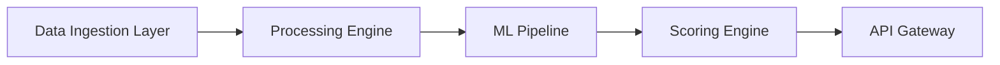

# CreDeFi

A decentralized credit scoring infrastructure leveraging blockchain data and artificial intelligence.

## Overview

CreDeFi is an enterprise-grade credit scoring platform that revolutionizes DeFi lending through advanced blockchain analytics and machine learning. Our platform provides real-time creditworthiness assessment by analyzing on-chain transaction patterns and over 70 key financial parameters.

## Core Features

**Decentralized Credit Scoring**
- Blockchain-powered transaction analysis
- AI-driven risk assessment
- Real-time credit score generation
- Comprehensive financial parameter evaluation

**Enterprise Integration**
- RESTful API architecture
- Secure endpoint access
- Scalable infrastructure
- Multi-chain support

## Technical Architecture



## API Documentation

```javascript
// Base URL: https://api.credefi.io/v1

// Authentication
POST /auth/token
Content-Type: application/json
{
    "api_key": "your_api_key",
    "secret": "your_secret"
}

// Fetch Wallet Analysis
GET /analytics/wallet/{address}
Authorization: Bearer {token}

// Generate Credit Score
POST /score/generate
Authorization: Bearer {token}
Content-Type: application/json
{
    "wallet_address": "0x...",
    "chain_id": "1",
    "parameters": {}
}
```

## Installation

```bash
# Clone repository
git clone https://github.com/CreDeFi/core.git

# Install dependencies
npm install

# Configure environment
cp .env.example .env

# Start development server
npm run dev

# Run tests
npm run test
```

## System Requirements

- Node.js 16+
- MongoDB 4.4+
- Redis 6+
- Ethereum Node (or compatible RPC)

## Configuration

```env
# Core Configuration
NODE_ENV=production
PORT=3000

# Database Configuration
MONGODB_URI=mongodb://localhost:27017/credefi
REDIS_URL=redis://localhost:6379

# Blockchain Configuration
ETH_NODE_URL=https://eth-mainnet.provider.com
CHAIN_ID=1

# Security
JWT_SECRET=your_jwt_secret
API_KEY_SALT=your_salt
```

## Development

```bash
# Run linter
npm run lint

# Generate documentation
npm run docs

# Build for production
npm run build
```

## Production Deployment

```bash
# Build application
npm run build

# Start production server
npm run start:prod

# Monitor processes
pm2 start ecosystem.config.js
```

## Security Measures

- End-to-end encryption
- Rate limiting
- JWT authentication
- API key validation
- Input sanitization
- DDOS protection

## Testing

```bash
# Unit tests
npm run test:unit

# Integration tests
npm run test:integration

# E2E tests
npm run test:e2e
```

## Contributing

1. Fork the repository
2. Create feature branch (`git checkout -b feature/amazing-feature`)
3. Commit changes (`git commit -m 'Add amazing feature'`)
4. Push to branch (`git push origin feature/amazing-feature`)
5. Open Pull Request

## Acknowledgments

Built with support from leading DeFi protocols and blockchain infrastructure providers.
